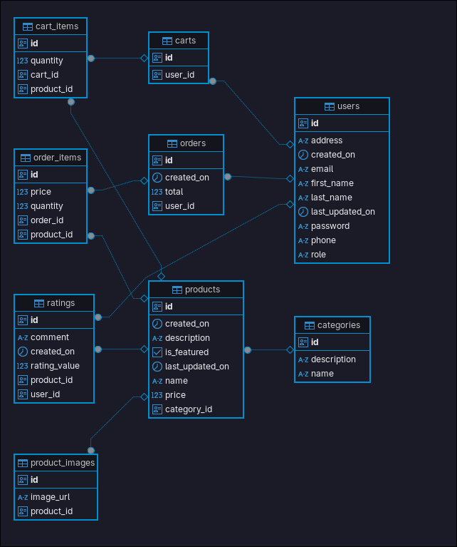

# BookNest Backend - E-Commerce API for Books

**BookNest** is a backend RESTful API for an e-commerce website focused on selling books. It's built with **Spring Boot** and provides secure endpoints for user authentication, book, user and category management, image uploading using **Cloudinary**, and payment integration with **VNPAY**. Authentication is handled using **JWT (JSON Web Tokens)** and the project is managed using **Maven**.

## Tech Stack

- **Framework:** Spring Boot
- **Authentication:** JWT (stateless, secure)
- **Image Storage:** Cloudinary
- **Database:** PostgreSQL
- **Build Tool:** Maven
- **ORM:** Spring Data JPA
- **Testing:** JUnit, Mockito
- **Other:** Lombok, Spring Security, Validation
- **Payment Gateway:** VNPAY

## Database Diagram for E-Commerce Website



## Features

- User Registration and Login
- JWT-based Authentication
- Role-based Authorization (Admin/User)
- Book, User, Category CRUD operations
- Upload book images to Cloudinary
- Pagination and Search
- Order processing and checkout
- VNPAY Integration for Online Payments

## API Route Authorization

The application secures endpoints based on user roles (`ROLE_ADMIN`, `ROLE_USER`). Below is a summary of public and protected routes.

---

### Public Routes (No Authentication Required)

| Method | Endpoint             | Description                            |
| ------ | -------------------- | -------------------------------------- |
| ANY    | `/v3/api-docs/**`    | Swagger API docs                       |
| ANY    | `/swagger-ui.html`   | Swagger UI                             |
| ANY    | `/swagger-ui/**`     | Swagger UI assets                      |
| POST   | `/api/users/login`   | User login                             |
| POST   | `/api/users/signup`  | User registration                      |
| POST   | `/api/users/logout`  | User logout                            |
| ANY    | `/api/vnpay/**`      | VNPAY payment gateway routes           |
| GET    | `/api/categories/**` | Publicly accessible product categories |
| GET    | `/api/products/**`   | Publicly accessible product listing    |
| GET    | `/api/ratings/**`    | Publicly viewable product ratings      |

---

### User Routes (Require `ROLE_USER` or `ROLE_ADMIN`)

| Method | Endpoint          | Description                |
| ------ | ----------------- | -------------------------- |
| ANY    | `/api/cart/**`    | User shopping cart         |
| ANY    | `/api/orders/**`  | User order history/actions |
| ANY    | `/api/users/me`   | Fetch logged-in user info  |
| POST   | `/api/ratings/**` | Create a rating            |

---

### Admin Routes (Require `ROLE_ADMIN`)

| Method | Endpoint             | Description     |
| ------ | -------------------- | --------------- |
| ANY    | `/api/roles/**`      | Role management |
| ANY    | `/api/users/**`      | User management |
| POST   | `/api/categories/**` | Create category |
| PUT    | `/api/categories/**` | Update category |
| DELETE | `/api/categories/**` | Delete category |
| POST   | `/api/products/**`   | Create product  |
| PUT    | `/api/products/**`   | Update product  |
| DELETE | `/api/products/**`   | Delete product  |

---

### All Other Routes

All unspecified routes require authentication and are restricted by default.

## Installation and Setup

### 1. Clone the Repository

```bash
git clone https://github.com/thientranreal/e-commerce-spring.git
cd e-commerce-spring
```

### 2. Configure Application Properties

#### Connect PostgreSQL Config

```properties
spring.datasource.url=jdbc:postgresql://localhost:5432/your_db_name
spring.datasource.username=your_db_username
spring.datasource.password=your_db_password
```

#### Driver PostgreSQL

```properties
spring.datasource.driver-class-name=org.postgresql.Driver
```

#### Hibernate (JPA) Config

```properties
spring.jpa.properties.hibernate.dialect=org.hibernate.dialect.PostgreSQLDialect
spring.jpa.hibernate.ddl-auto=update
spring.jpa.show-sql=true
```

#### JWT config

```properties
app.jwt-secret=your_jwt_secret
app.jwt-expiration-milliseconds=604800000
```

#### Cloudinary config

```properties
cloudinary.cloud-name=your_cloud_name
cloudinary.api-key=your_api_key
cloudinary.api-secret=your_api_secret
```

#### Frontend URL

```properties
frontend.url=your_frontend_url
```

#### VNPay Config

```properties
vnp_TmnCode=your_vnp_TmnCode
vnp_HashSecret=your_vnp_HashSecret
vnp_Url=your_vnp_Url
vnp_ReturnUrl=your_vnp_ReturnUrl
```

### 3. Build and Run

```bash
mvn clean install
mvn spring-boot:run
```
